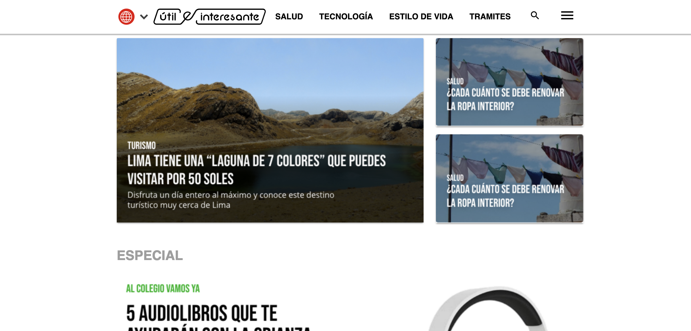
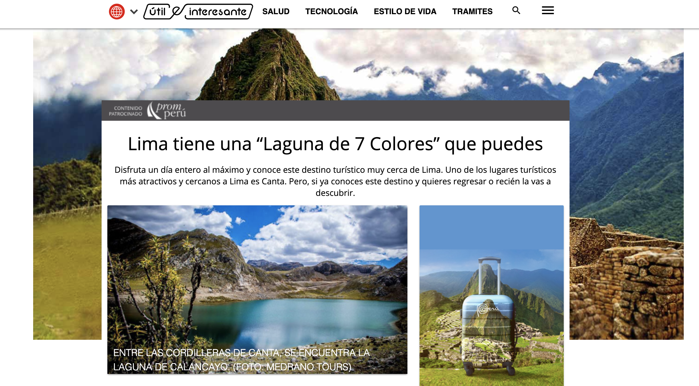

# Útil e Interesante
Test Mockup developed for America TV

## Tutorial
To run the app you must have Node Installed.

1. Git clone https://github.com/luisenriquecgongora/utileinteresante
2. Run: npm install && npm start

# Demo
A live demo is located [here](https://americauei.oracliom.com/). The following is a Mockup of the App.
### Landing

### Blog

### Mobile

